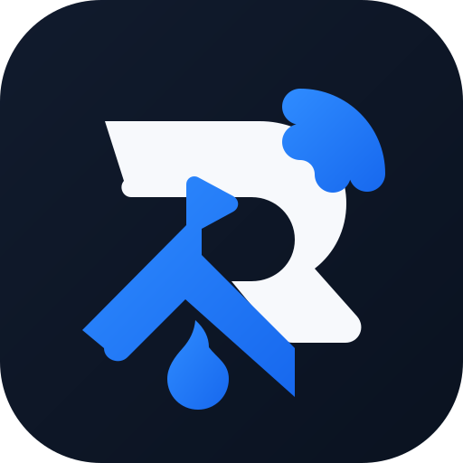

# RCAMP

<p align="center"></p>

> **One controller. Many devices. Local by default.**

RCAMP is an open-source, local-first platform for managing and controlling hardware: ESP32 projects, Arduino boards, robots, RC cars, projectors, serial devices, and custom equipment.

There is no required cloud account and no RCAMP server in the control path.

```text
Your device  ── Wi-Fi / Bluetooth / USB ──  RCAMP
```

Built with Rust, Tauri 2, Svelte, and TypeScript. Licensed under [Apache-2.0](LICENSE).

## Two interfaces, one core

```text
                 ┌─ RCAMP GUI ───── Linux · Windows · Android
                 │
rcamp-core ──────┼─ RCAMP/CLI ───── Linux · Windows
                 │
                 └─ Device profiles · transports · device state
```

The GUI and CLI use the same Rust core. Hardware communication belongs in the core—not in the Svelte frontend or a separate CLI implementation.

## What is included

| Area | Included now |
| --- | --- |
| GUI | A dark, touch-friendly Tauri/Svelte device workspace and local session profile creation |
| CLI | `rcamp` command interface and keyboard-first TUI shell |
| Core | Device model, profile validation, device manager, transport model |
| CI | Linux AppImage, Windows MSI, Android APK/AAB, and standalone CLI artifacts |
| Security | Input validation boundaries, no committed signing material, no cloud requirement |

## Transport model

RCAMP treats a transport as a capability of a device profile, not as an assumption about every device.

| Family | Modelled transports |
| --- | --- |
| Network | TCP, UDP, HTTP, WebSocket, MQTT |
| USB | Serial and USB-to-serial |
| Bluetooth | BLE GATT |

Transport adapters and discovery integrations are added incrementally. The current foundation models them without pretending every adapter is already implemented.

## Quick start

## Website

The project landing page is in [`website/`](website/). Enable **Settings → Pages → Source: GitHub Actions** in your GitHub repository; pushes to `main` then deploy it through the **Deploy website** workflow.

### Build from GitHub Actions — no Rust installation needed

1. Create a GitHub repository and push this project.
2. Open the repository’s **Actions** tab.
3. Select **Build RCAMP** and run it, or push a commit.
4. Download the artifacts from the completed run.

The workflow installs Node.js, Rust, Java, Android SDK, Android NDK, and platform dependencies on GitHub-hosted runners. Your computer does not need Rust installed.

Artifacts produced by the workflow:

```text
RCAMP-linux-appimage     Linux GUI AppImage
RCAMP-windows-msi        Windows GUI installer
RCAMP-android-apk        Installable Android APK
RCAMP-android-aab        Android App Bundle for distribution
RCAMP-cli-linux          RCAMP/CLI Linux archive
RCAMP-cli-windows        RCAMP/CLI Windows archive
```

### Local development

For local GUI/CLI development, install a current Rust toolchain and Node.js, then run:

```sh
npm install
npm run check
cargo fmt --check
cargo test -p rcamp-core -p rcamp-cli
npm run tauri dev
```

Open the terminal interface with:

```sh
cargo run -p rcamp-cli --
```

Useful CLI commands currently available:

```sh
rcamp devices list
rcamp devices discover
rcamp devices info <device>
rcamp doctor
rcamp version
```

### Install RCAMP/CLI from a release

After a `v*` tag is published, GitHub Actions creates release assets for Linux and Windows. Install without Rust:

```powershell
irm https://raw.githubusercontent.com/KiddosTech/RCAMP/main/scripts/install.ps1 | iex
```

```sh
curl -fsSL https://raw.githubusercontent.com/KiddosTech/RCAMP/main/scripts/install.sh | sh
# or
wget -qO- https://raw.githubusercontent.com/KiddosTech/RCAMP/main/scripts/install.sh | sh
```

For a pinned release, set `RCAMP_VERSION` before running the script (for example `v0.1.0`).

## Device profiles

Profiles describe a device; they do not execute arbitrary code or assume a common protocol.

```json
{
  "name": "Workshop RC Car",
  "type": "rc-car",
  "connection": "tcp",
  "address": "192.168.1.42:80",
  "capabilities": ["drive", "light", "telemetry"],
  "controls": {
    "motor_left": "motor_left",
    "motor_right": "motor_right"
  }
}
```

The initial GUI can create a TCP profile for the active session. Durable local profile storage, discovery adapters, and transport connections are the next milestones.

## Repository layout

```text
.
├── crates/
│   ├── rcamp-core/       Shared device, profile, and transport abstractions
│   └── rcamp-cli/        RCAMP/CLI command interface and TUI
├── src/                  Svelte + TypeScript frontend
├── src-tauri/            Tauri application and GUI-to-core commands
└── .github/workflows/    Linux, Windows, Android, and CLI builds
```

## Development checks

```sh
npm run check
npm run build
cargo fmt --check
cargo test -p rcamp-core -p rcamp-cli
cargo clippy --workspace --all-targets -- -D warnings
```

Hardware is not required for automated tests. Device/network/serial/Bluetooth input must always be treated as untrusted.

## Android signing

Signing keys never belong in the repository. For release signing, store them only as GitHub Actions secrets:

```text
ANDROID_KEY_BASE64
ANDROID_KEY_ALIAS
ANDROID_KEY_PASSWORD
ANDROID_STORE_PASSWORD
```

The default CI build is suitable for development and artifact testing. Configure release signing before publishing to an app store.

## Status and direction

RCAMP is at the foundation stage. The project has a real cross-platform shell, shared core, CLI/TUI, and CI packaging pipeline. Next work focuses on persistent profiles, TCP/serial adapters, discovery, connection lifecycle, and capability-driven controls.

## Contributing and security

Contributions are welcome. Start with [CONTRIBUTING.md](CONTRIBUTING.md), and report vulnerabilities according to [SECURITY.md](SECURITY.md).

## License

RCAMP is licensed under the [Apache License 2.0](LICENSE).
